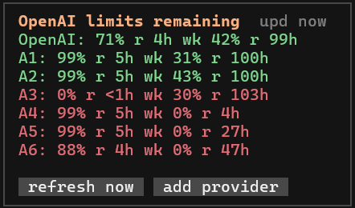
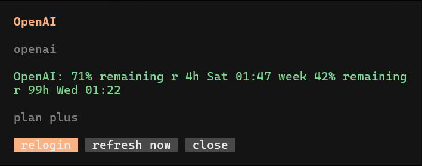

<div align="center">

# OpenCode OpenAI Limits

**Run multiple OpenAI accounts in OpenCode without guessing which one still has Codex quota.**

Track ChatGPT Pro/Plus Codex usage, add provider logins, relogin accounts, and refresh limits from one TUI panel.

<p><strong>OpenCode TUI plugin</strong> / <strong>Multi-account OpenAI</strong> / <strong>Credentials stay local</strong></p>

</div>

## Preview

<div align="center">



<p><strong>Limits at a glance.</strong> See every connected OpenAI account and its remaining Codex windows from the OpenCode home screen.</p>



<p><strong>Provider control.</strong> Relogin, refresh, or close the account dialog from one focused view.</p>

</div>

## Why

- Use multiple OpenAI accounts without losing track of remaining Codex limits.
- Add and relogin providers from the TUI instead of hand-editing config files.
- Keep every developer's credentials local to their own OpenCode auth store.
- Refresh usage in the background without blocking your OpenCode session.

## Features

| Area | What it does |
| --- | --- |
| Limits | Shows remaining ChatGPT Pro/Plus Codex usage inside OpenCode. |
| Providers | Discovers OpenAI providers from OpenCode config and local auth. |
| Multi-account | Adds new OpenAI providers from the TUI with `/limits-add`. |
| Login | Opens browser OAuth login for each provider. |
| Management | Supports relogin, refresh, and remove actions from the provider dialog. |
| Safety | Keeps credentials local in OpenCode's own auth store. |
| Background refresh | Uses a writer plugin so usage stays fresh without blocking the TUI. |

## Commands

- `/limits` - open the full limits dialog.
- `/limits-refresh` - refresh current usage.
- `/limits-add` - add a new OpenAI provider and start browser login.
- Click a provider row - login, relogin, refresh, or remove that provider.

## Install

Clone this repo or download the files, then run the installer for your OS from the repo root.

macOS:

```sh
sh ./install.sh
```

Windows:

```powershell
.\install.ps1
```

This copies the plugin files into:

```text
macOS:  ~/.config/opencode/plugins
Windows: %USERPROFILE%\.config\opencode\plugins
```

Add the background writer plugin to your OpenCode `opencode.jsonc`:

```jsonc
{
  "plugin": ["./plugins/openai-limits-writer.ts"]
}
```

If you already have a `plugin` array, append `"./plugins/openai-limits-writer.ts"` to it.

Add the TUI plugin to your OpenCode `tui.jsonc`:

```jsonc
{
  "plugin": ["./plugins/openai-limits.tsx"]
}
```

If you already have a `plugin` array, append `"./plugins/openai-limits.tsx"` to it.

Restart OpenCode after installing.

## Multi-Account Flow

1. Run `/limits-add`.
2. Enter a provider id, for example `openai-work` or `openai-alt`.
3. Finish the browser login with the OpenAI account you want attached to that provider.
4. Run `/limits-refresh`.
5. Click any provider row later to relogin, refresh, or remove it.

The plugin creates provider config automatically and stores the OAuth credential under that provider id in your local OpenCode auth file.

## Files

- `plugins/openai-limits.tsx` - TUI panel, dialogs, add/login/relogin/remove actions.
- `plugins/openai-limits-writer.ts` - background usage cache writer.
- `plugins/openai-limits-shared.ts` - shared config, auth discovery, and provider helpers.
- `install.sh` - local installer for macOS shells.
- `install.ps1` - local installer for Windows PowerShell.

## Security

This repository does not contain OpenAI credentials.

Do not commit or share these local runtime files:

- `%USERPROFILE%\.local\share\opencode\auth.json`
- `%USERPROFILE%\.local\share\opencode\openai-limits.json`
- `%USERPROFILE%\.local\share\opencode\openai-limits.refresh`
- `%USERPROFILE%\.local\share\opencode\openai-limits-login*.cmd`
- `%USERPROFILE%\.local\share\opencode\openai-limits-login*.sh`
- `%USERPROFILE%\.local\share\opencode\openai-limits-*.cjs`
- `~/.local/share/opencode/auth.json`
- `~/.local/share/opencode/openai-limits.json`
- `~/.local/share/opencode/openai-limits.refresh`
- `~/.local/share/opencode/openai-limits-login*.sh`
- `~/.local/share/opencode/openai-limits-*.cjs`

OpenCode stores each developer's local OAuth credentials in their own `auth.json` after browser login.

The plugin contains a public OpenAI OAuth app id used by OpenCode browser login. That value is not a user secret.

## Notes

- Supports Windows and macOS launchers for browser login.
- The usage data is cached locally and can be rebuilt with `/limits-refresh`.
- Removing a provider deletes its provider config and its local credential for that provider id.
